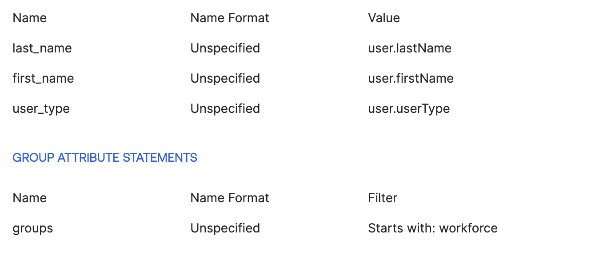

# Google Cloud Workforce Identity Federation with Okta 

This is the Okta portion of a multi project set of examples for configuring Google Cloud Workforce Identity Federation. 
- https://cloud.google.com/iam/docs/workforce-sign-in-okta
- https://cloud.google.com/iam/docs/manage-workload-identity-pools-providers

## Google Disclaimer
This is not an officially supported Google product

## Prerequisites
- An existing Google Project
- A free Okta account

## Pool Creation in Google Cloud
```bash
export PROJECT_ID=[Google Project ID]
export ORG_ID=[Google Organization ID]
gcloud services enable cloudresourcemanager.googleapis.com
gcloud services enable iam.googleapis.com
gcloud config set billing/quota_project $PROJECT_ID

gcloud iam workforce-pools create okta-workforce-pool \
--location="global"  \
--organization=$ORG_ID \
--description="Company Workforce Pool for Okta" \
--display-name="Okta Workforce Pool"
```

## Setup Okta Application
Create the Okta Workforce Pool application that will be assigned to the users and/or group leveraging Workforce authentication. For this example, I set up a SAML application according to the [Google and Okta instructions](https://cloud.google.com/iam/docs/workforce-sign-in-okta#create-okta-app). The URLs that you'll need will be based on the following.

- Single sign on URL: https://auth.cloud.google/signin-callback/locations/global/workforcePools/okta-workforce-pool/providers/global-workforce-provider
- Audience URI (SP Entity ID).: https://iam.googleapis.com/locations/global/workforcePools/okta-workforce-pool/providers/global-workforce-provider

Shown here is the mapping that I chose which goes along with the workforce provider creation below:


- Finally, download the OktaIdentityXML.xml file. e.g. GCPWorkforceIdentityOkta.xml

## Provider Creation in Google Cloud
You'll need the downloaded OktaIdentityXML.xml file from your Okta application above. Additionally, the attribute mapping will be dependant on your needs.
```bash
gcloud iam workforce-pools providers update-saml okta-global-workforce-provider \
    --workforce-pool=okta-workforce-pool \
    --attribute-mapping="google.subject=assertion.subject,\
        google.groups=assertion.attributes.groups,\
        attribute.first=assertion.attributes.first_name[0],\
        attribute.last=assertion.attributes.last_name[0],\
        attribute.emptype=assertion.attributes.user_type[0]" \
    --idp-metadata-path=./GCPWorkforceIdentityOkta.xml \
    --location=global

#Review the configuration with the following command
#gcloud iam workforce-pools providers list --workforce-pool=okta-workforce-pool --location=global
```


## Example permissions
 To validate, I created a couple of users and a group in Okta that I had no way to sync to Google Cloud or validate the domain.
- User: test.workforceidentity@external.com
- User: okta_workforce_cli@not-in-google-identity.com
- Group: workforce_not_synced

The permissions below are examples
```bash
#Everyone can access/manage storage
gcloud projects add-iam-policy-binding $PROJECT_ID \
    --role="roles/storage.admin" \
    --member="principalSet://iam.googleapis.com/locations/global/workforcePools/okta-workforce-pool/*"

#Only one user gets access to compute
gcloud projects add-iam-policy-binding $PROJECT_ID \
    --role="roles/compute.instanceAdmin" \
    --member="principal://iam.googleapis.com/locations/global/workforcePools/okta-workforce-pool/subject/okta_workforce_cli@not-in-google-identity.com"

#Allows everyone in the group access to Compute Viewer
gcloud projects add-iam-policy-binding $PROJECT_ID \
    --role="roles/compute.viewer" \
    --member="principalSet://iam.googleapis.com/locations/global/workforcePools/okta-workforce-pool/group/workforce_not_synced"

#Allows only FTEs in the Group as Compute Admin
gcloud projects add-iam-policy-binding $PROJECT_ID \
    --role="roles/bigquery.dataViewer" \
    --member="principalSet://iam.googleapis.com/locations/global/workforcePools/okta-workforce-pool/attribute.emptype/FTE"
```
Based on the above, and the associated attributes and group membership in Okta, the following is true:
### Effective Permissions
test.workforceidentity@external.com
- roles/compute.viewer
- roles/storage.admin
- roles/bigquery.dataViewer

okta_workforce_cli@not-in-google-identity.com
- roles/storage.admin
- roles/compute.instanceAdmin

## Test it out
### Console Access
- Workforce Identity Console Access: https://console.cloud.google
- Enter: locations/global/workforcePools/[workforce_pool]/providers/[workforce_provider]
- e.g.: locations/global/workforcePools/okta-workforce-pool/providers/okta-global-workforce-provider

### CLI gcloud Access
```bash
#Create Login Config
gcloud iam workforce-pools create-login-config \
    locations/global/workforcePools/okta-workforce-pool/providers/okta-global-workforce-provider \
    --output-file=./gcloud_config_workforce.json

#Authenticate
gcloud auth login --login-config=./gcloud_config_workforce.json

#Validate
gcloud storage ls
```